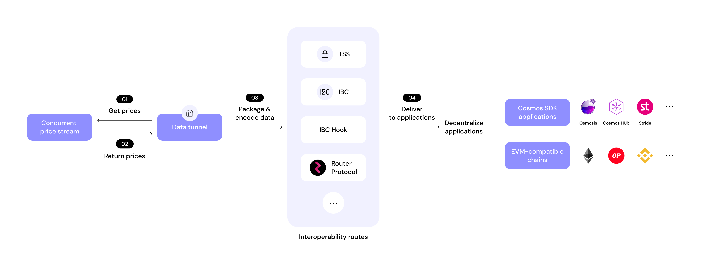

# Tunnel Architecture

## Overview

The **Data Tunnel** serves as a bridge for relaying price data from a concurrent price stream to decentralized applications. It ensures seamless interoperability between various blockchain networks, including Cosmos SDK applications, L1/L2+ EVM contracts, and non-EVM contracts.

## Components

### 1. **Concurrent Price Stream**

The Concurrent Price Stream is responsible for obtaining real-time pricing data from validators. The stream continuously aggregates price data from multiple trusted validators, ensuring that the Data Tunnel always has access to high-quality and reliable price feeds. The **Data Tunnel** actively collects this price information from the Concurrent Price Stream for processing and transmission. Through this mechanism, BandChain maintains an up-to-date price oracle that enables Data Tunnels to efficiently relay price data to various blockchain networks.

### 2. **Data Tunnel**

The Data Tunnel serves as the main process for producing tunnel packets data. It is responsible for:

- Collecting price information from the Concurrent Price Stream
- Producing packets from the tunnel based on interval and the price deviation triggering condition
- Formatting and packaging data into packets based on tunnel route
- Sending structured packets into the Data Tunnel Routes

### 3. **Data Tunnel Routes**

The **Data Tunnel Routes** consist of multiple interoperability mechanisms that facilitate secure and efficient data transmission to send tunnel packets to decentralized applications. These mechanisms include:

- **Threshold Signature Scheme**: Ensures cryptographic security for transactions to send it to decentralized applications.
- **IBC (Inter-Blockchain Communication Protocol)**: Provides communication between different Cosmos-based blockchains.
- **IBC Hook**: Extends IBC functionalities, allowing customized interactions with WASM contracts on Cosmos-based blockchains.
- **Router Protocol**: First blockchain interoperability platform that supports Band Data Tunnel.
- **Other Interoperability Protocols**: Additional methods that enhance cross-chain compatibility in the future.

### 4. **Decentralized Applications**

Once the data is processed and routed, it is relayed to various decentralized applications, including:

- **Cosmos SDK Applications**: Applications built on Cosmos that rely on accurate price feeds.
- **L1/L2+ EVM Contracts**: Smart contracts deployed on Ethereum and other EVM-compatible networks.
- **Non-EVM Contracts**: Contracts on blockchains that do not use the Ethereum Virtual Machine.

## Data Flow Summary

1. **Price Data Retrieval:** The Concurrent Price Stream fetches price information.
2. **Processing:** The Data Tunnel processes and formats price data into structured packets.
3. **Routing:** The Data Tunnel Routes use interoperability mechanisms based on the tunnel creator's choice to relay data securely.
4. **Delivery:** The processed data is sent to decentralized applications for execution.
